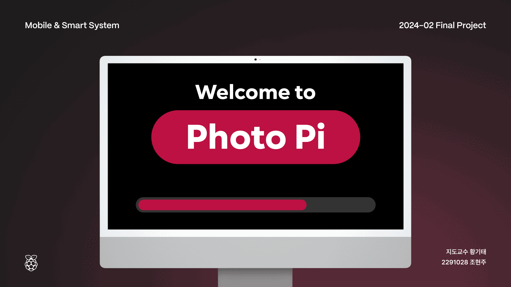

# 📸 Photo Pi

**Photo Pi**는 라즈베리 파이를 활용한 스마트 포토 부스 시스템입니다.  
사용자의 입장을 감지하고, 부스 내부의 환경을 최적화하며, 간단한 인터페이스로 사진을 촬영할 수 있도록 설계되었습니다.

---

## 🎥 Slide Preview

  

---

## 📝 소개

Photo Pi는 초음파 센서를 이용해 사용자의 입장을 자동으로 감지하고, 조도 및 온습도 센서를 통해 부스 환경을 쾌적하게 유지합니다. 사용자는 버튼을 이용해 촬영할 사진 매수를 선택하고, 카메라로 촬영한 사진을 웹 브라우저에서 확인할 수 있습니다.

### 주요 기능
- 🕵️‍♂️ **사용자 입장 감지**: 초음파 센서를 통해 자동으로 사용자 입장을 감지
- 💡 **환경 최적화**: LED와 센서를 활용한 부스 내부 조명 및 환경 조절
- 🎛 **사진 촬영 매수 선택**: 스위치를 통해 사진 매수 및 재촬영 여부 입력
- ⏳ **자동 촬영**: 카운트다운 후 사진 자동 촬영
- 🌐 **웹 UI 제공**: 웹 브라우저에서 촬영된 사진을 확인하고 재촬영 가능
- 📊 **관리자 페이지**: 온습도, 조도 등 실시간 센서 데이터를 시각화

---

## 🎬 화면 구성

### 1. 초기 화면
   - 사용자가 부스 앞에 다가가면 입장을 감지합니다.

### 2. 촬영 매수 선택 화면
   - 스위치를 사용해 촬영할 사진 매수를 선택합니다.

### 3. 사진 촬영 화면
   - 카운트다운 후 카메라가 자동으로 사진을 촬영합니다.

### 4. 결과 화면
   - 촬영된 사진을 확인하고 재촬영 여부를 선택합니다.

### 5. 관리자 페이지
   - **실시간 센서 데이터 확인**: 조도, 온도, 습도 데이터를 실시간 차트로 확인
   - **부스 상태 모니터링**: LED 상태와 부스 환경을 점검 가능

---

## 🗂 시스템 구조

```plaintext
photopi/
├── app.py               # Flask 웹 서버
├── camera.py            # 카메라 제어 모듈
├── led_control.py       # LED 제어 모듈
├── sensors.py           # 센서 데이터 처리 모듈
├── switches.py          # 스위치 입력 처리
├── utils.py             # 유틸리티 함수
├── static/              # 정적 파일 (CSS, 이미지 등)
│   ├── logo.svg
│   ├── photos/          # 촬영된 사진 저장 디렉토리
│   │   ├── photo_1.jpg
│   │   └── photo_2.jpg
│   └── style.css        # 스타일시트
└── templates/           # HTML 템플릿
    ├── index.html              # 초기 화면
    ├── select_count.html       # 촬영 매수 선택 화면
    ├── display_photos.html     # 결과 화면
    ├── start_photo.html        # 촬영 시작 화면
    ├── countdown.html          # 카운트다운 화면
    ├── end.html                # 종료 화면
    └── admin_dashboard.html    # 관리자 페이지
```

---

## ⚙ 기술 스택

| **구분**       | **기술/장치**                    | **설명**                                   |
|----------------|----------------------------------|-------------------------------------------|
| **Hardware**   | 라즈베리 파이                   | 프로젝트 메인 컨트롤러                    |
|                | 카메라 모듈                     | 사진 촬영용                               |
|                | 초음파 센서                     | 사용자 입장 감지                          |
|                | LED                             | 부스 내부 조명 조절                       |
|                | HTU21D 센서                    | 부스 내부 온습도 측정                     |
|                | 조도 센서                       | 주변 밝기 측정 및 부스 환경 조정          |
|                | 스위치                          | 사진 매수 선택 및 재촬영 여부 입력        |
| **Back-end**   | Python, Flask                   | 서버 및 비즈니스 로직 구현                |
| **Front-end**  | HTML, CSS                       | 웹 브라우저 인터페이스 구현               |
| **Tools**      | GitHub, Notion                  | 버전 관리 및 문서화                       |

---

## 🚀 설치 및 실행 방법

1. 라즈베리 파이 환경 설정
    ```bash
    sudo apt update && sudo apt upgrade
    sudo apt install python3-pip
    ```

2. 프로젝트 클론 및 의존성 설치
    ```bash
    git clone https://github.com/hjuump/photopi.git
    cd photopi
    ```

3. Flask 서버 실행
    ```bash
    python app.py
    ```

4. 웹 브라우저에서 `http://localhost:5000` 접속

---

## 🎯 주요 기술 과제

1. **센서 데이터 통합**  
   - 초음파, 조도, 온습도 센서 데이터를 Flask와 MQTT를 통해 실시간 수집 및 처리

2. **환경 반응형 LED 제어**  
   - 조도 데이터를 기반으로 LED 밝기 자동 조절

3. **관리자 페이지 구현**  
   - 실시간 센서 데이터를 시각화하고, 환경 제어를 테스트할 수 있는 대시보드 제공

---

## 📂 문서

| **문서 종류**       | **링크**                      |
|---------------------|-------------------------------|
| **📖 발표 자료**    | [Presentation](docs/slides.pdf) |
| **📑 프로젝트 보고서**| [Report](docs/report.pdf)      |

---

## 👩‍💻 제작

- 한성대학교 컴퓨터공학부 22학번 조현주
